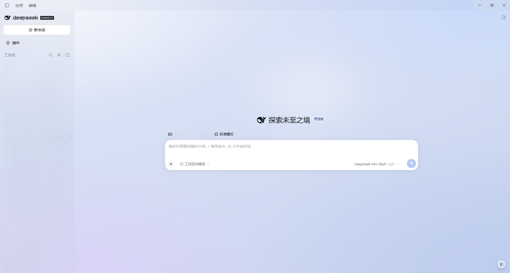
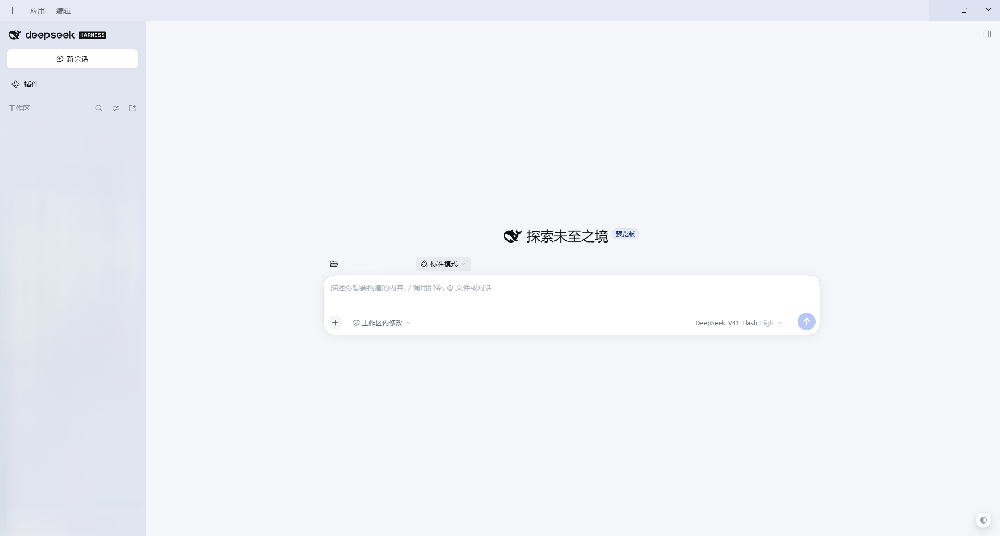
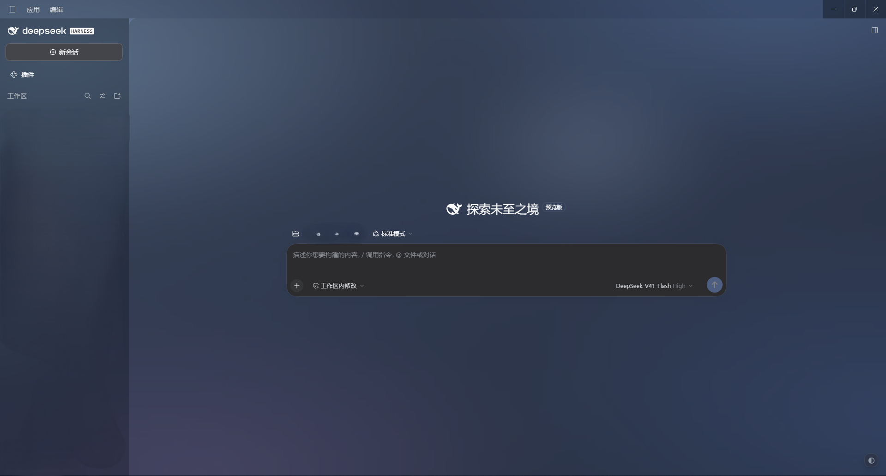
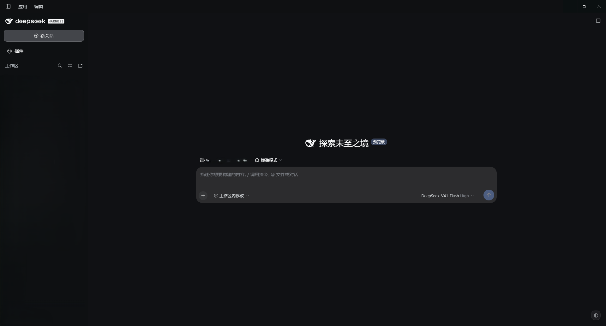
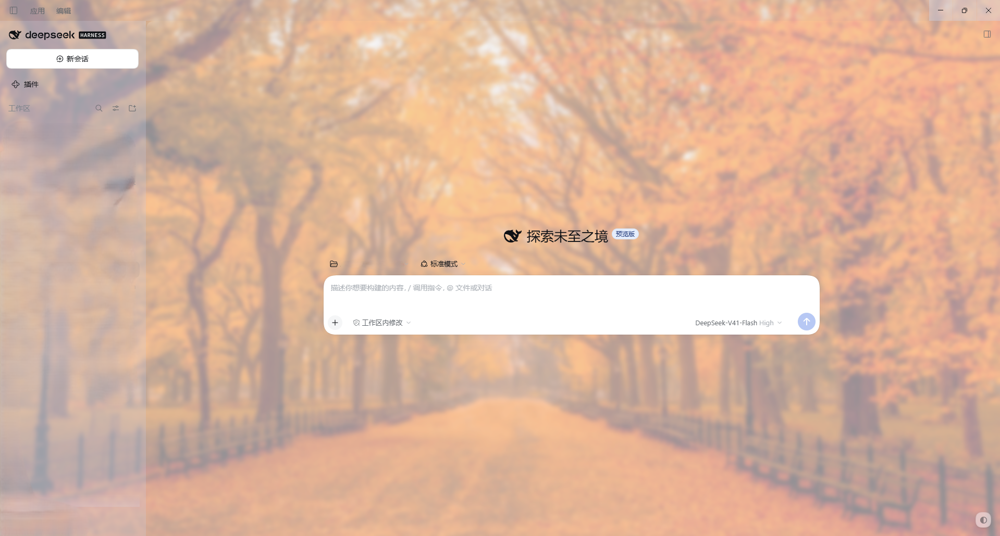

# dsh-glass-skin

DSH（DeepSeek Harness）Web UI 的**页面级玻璃皮肤**：会话画布与侧栏变成半透明玻璃，底下垫一层重模糊的冷灰蓝背景。
装上之后右下角会多一个圆钮，那就是它的控制台。

| 开启皮肤 | 关闭皮肤（原版对照） |
| :---: | :---: |
|  |  |
|  |  |

## 安装

**桌面客户端**（`DeepSeek Harness.exe`）用 `desktop`：

```sh
dsh plugin --profile desktop add github:Lenandy/dsh-glass-skin
```

**浏览器 / 命令行**（`dsh web`）用 `web`：

```sh
dsh plugin --profile web add github:Lenandy/dsh-glass-skin
```

装哪个就填哪个——**填错会完全没有反应**：DSH 不会加载它，重启多少次都没用。两边都装也可以，各填各的。

装完**重启 DSH**。刷新页面不够。

也可以打开页面上的**插件管理 → 添加插件**，把同一个地址粘进去。

<details>
<summary>怎么确认装上了 / 用的是别的 profile / 卸载</summary>

装上了的样子：重启后右下角出现那个圆钮，点开控制台，标题里能读到版本号。

如果你用的不是 `desktop` 或 `web`（自建的 profile、TUI 等），从进程命令行里读它**实际加载**的那个名字——
`--profile` 是必填项，填的就是这里读出来的值：

```powershell
Get-CimInstance Win32_Process -Filter "Name='DeepSeek Harness.exe'" |
  ForEach-Object { [regex]::Match([string]$_.CommandLine, 'profiles\\(\S+)').Groups[1].Value }
```

卸载（把名字换成你装的那个）：

```sh
dsh plugin --profile web remove dsh-glass-skin
```

</details>

> 在 DSH 桌面版 `0.2.0-rc.2`（Electron 44 / Chrome 152）上实测。

## 特性

- **真玻璃，不是贴图**——玻璃是真的半透明，它后面的背景也是真的在模糊。卡片、气泡和输入框保持实心，所以文字始终清晰。
- **控制台**——右下角圆钮，纯鼠标操作，不需要 DevTools。
- **明暗各自独立**——浓度和遮罩按配色分开保存：同一组数值在浅色下是死白，在深色下却是层次。
- **三个预设**——通透 / 标准 / 厚重，一键设好，不用自己试。
- **壁纸三种来源**——图片直链 · **搜索引擎结果页链接（自动取出真实图片地址）** · 本机选图。
- **自我诊断**——实时实测「叠加后不透明度」，超过 85% 就报警并告诉你往哪调。
- **随时可退**——关掉就恢复原版；皮肤**永远不改你的浅色/深色偏好**。

## 控制台

| 控件 | 作用 |
|---|---|
| **浓度** | 玻璃强弱。`100%` = 出厂（暗色叠加后约 59%、浅色约 55%），`0%` = 表面全透明 |
| **模糊** | 背景模糊半径（明暗共用）。拉到 `0` 就是清晰壁纸 |
| **遮罩** | 在背景上压一层，用来把文字对比度拉回来。**随配色变**：暗色压黑、浅色提白 |
| **通透 / 标准 / 厚重** | 一次设好浓度 + 遮罩 |
| **壁纸** | 见下一节。右侧三个图标按钮：**选图** · **用** · **清除** |
| **关闭皮肤 / 详情 / 重置** | 「详情」是完整诊断报告；「重置」恢复全部默认，与壁纸那个「清除」不是一回事 |

## 壁纸

| 你手上是什么 | 怎么做 |
|---|---|
| 图片直链、`data:` URL | 粘进输入框 → 点 **✓** |
| **搜索引擎图片结果页的链接** | 直接粘进去点 **✓**。那种链接是 HTML 页面、不是图片，插件会**自己从 `mediaurl` 参数里解出真正的图片地址**再加载（Bing / Google 图片结果都是这个参数名），成功后存的是解出来的地址 |
| 本机图片 | 点 **🖼 选图**，走文件选择器 |

图片**先探测再应用**：加载不出来就保留内置背景，**不会黑屏**，并在行下方写明原因。本地图片限 2MB（本地存储放不下更大的）。



## 已知边界

- **不是真·亚克力**——背景是插件自己铺的一层图，所以拖动窗口时它不会跟着动。要让窗口本身变成系统材质，得由 DSH 客户端来做，插件做不到。
- 玻璃面板后面若有高对比内容，文字对比度会下降；调大「遮罩」即可。

## 隐私

插件只改样式，**不采集、不上报任何数据**——所有偏好都存在你自己浏览器的 `localStorage` 里，卸载或点「重置」即清空。
唯一的外发请求是**你填的壁纸地址**：由浏览器按你自己的网络直接取那张图，没有中转、没有统计。

## 许可

[MIT](LICENSE)
